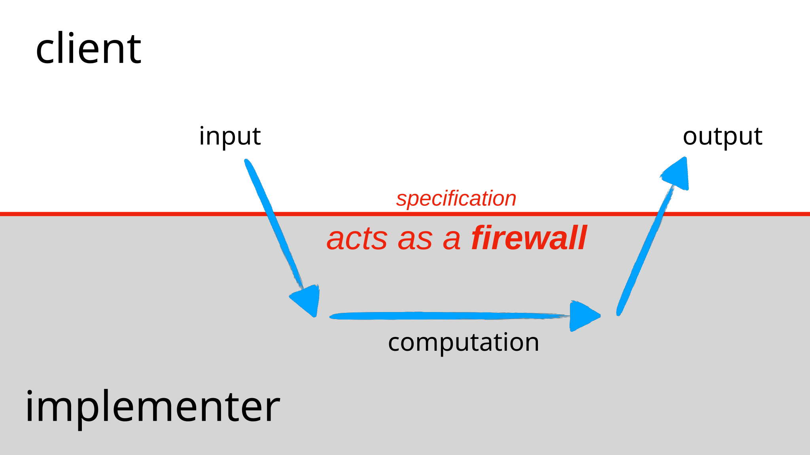
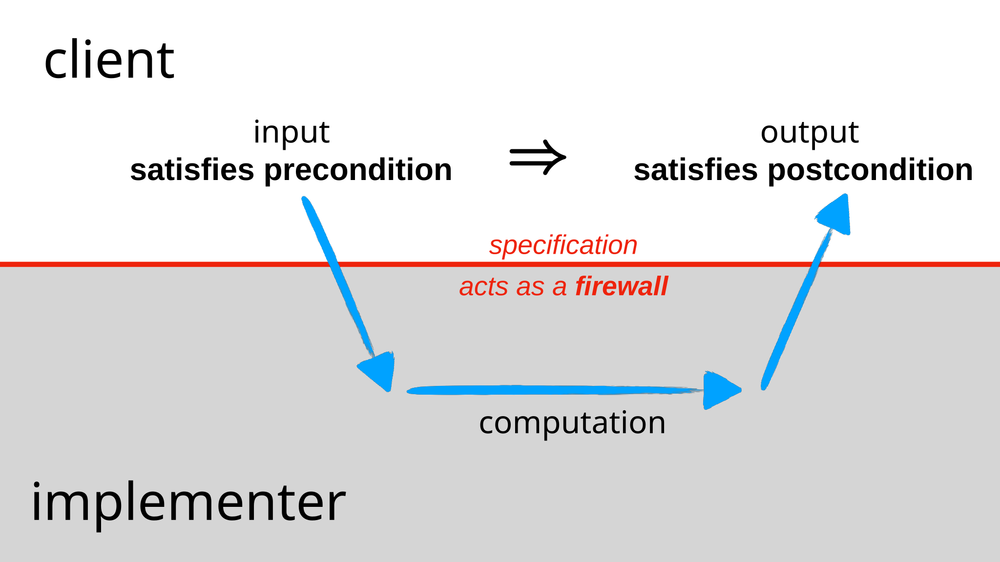
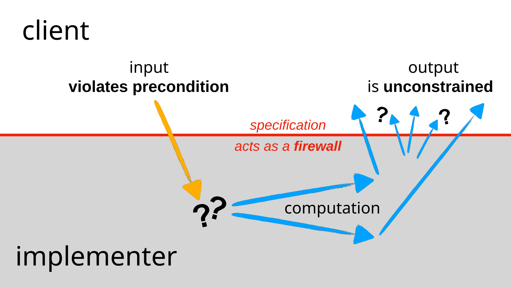
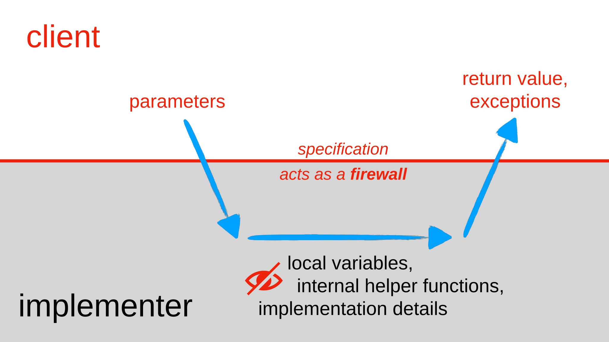

# **Specifications**

**Course:** 6.102 Software Construction
**Topic:** Specifications

**The Big Three:**
* Safe from bugs (SFB)
* Easy to understand (ETU)
* Ready for change (RFC)

<!-- note: Specifications are the linchpin of teamwork. They allow us to delegate responsibility for implementing functions and act as a formal contract between the implementer and the client. -->

---

### Learning Objectives

By the end of this lecture, you should be able to:
* Understand preconditions and postconditions.
* Write correct function specifications using TypeDoc.
* Write tests against a specification.
* Use exceptions and special results effectively to make interfaces safer.

---

### The Specification as a Contract

The specification acts as a legal contract.
* **Implementer's Responsibility:** Meeting the contract requirements.
* **Client's Responsibility:** Relying on the contract and meeting any preconditions.

Specifications place demands on both parties.

---

### Behavioral Equivalence

**Question:** Can we substitute one implementation for another without introducing bugs?

**Correctness:** Behavioral equivalence is determined by whether the change affects the correctness of the program.
* Equivalence is "in the eye of the beholder" (the client).

---

### Example: The find Function (1/2)

Consider a function finding an integer index:
* **Implementation 1:** Searches from the start (returns lowest index).
* **Implementation 2:** Searches from both ends (returns lowest or highest index).

If the client only passes arrays with exactly one matching element, these implementations are behaviorally equivalent.

---

### Example: The find Function (2/2)

To make these implementations equivalent, we need a spec:

```typescript
find(arr, val)
requires: val occurs exactly once in arr.
effects: returns index i such that arr[i] = val.
```

The spec only describes behavior for legal calls.

---

### Why Use Specifications?

* **Avoiding Misunderstandings:** Many bugs arise from disagreements at the interface between code.
* **Apportioning Blame:** Precise specs help determine if the bug is in the client or the implementation.
* **Communication:** Not all programmers write specs down, leading to team conflicts.

---

### Specifications as a "Label"

Specs make a module easier to understand, like a label on a black box.
* The client can understand what a module does without reading its source code.
* This is crucial because implementations can be far more complex than their descriptions.

---

### The Specification Firewall



The contract acts as a firewall between the client and implementer.
* **Shields the Client:** From the inner workings/implementation details.
* **Shields the Implementer:** From the details of how the module is used by various clients.

---

### Decoupling and Implementation Freedom

* **Decoupling:** Allows the module and client code to change independently as long as they respect the spec.
* **Freedom:** The implementer can change the code to be faster or more efficient without telling the client, provided the contract is met.

---

### Abstract Structure of a Specification

A specification consists of:
* **Function Signature:** Name, parameter types, return type.
* **Requires Clause:** Restrictions on parameters (Precondition).
* **Effects Clause:** Return values, exceptions, and side effects (Postcondition).

---

### Preconditions

* **Obligation on the Client:** The caller must ensure these conditions are true.
* **TypeScript Checks:** Can statically check the number and basic types of parameters.
* **Requires Clause:** Covers things types can't, like "x must be a non-negative integer" or "val must exist in arr".

---

### Postconditions

* **Obligation on the Implementer:** What the function promises to do.
* **TypeScript Checks:** Can statically check the return type.
* **Effects Clause:** Describes the relationship between input/output, which exceptions are thrown, and mutation of objects.

---

### The Logical Implication



The spec is a logical if-then statement.
* If the precondition holds when invoked, then the postcondition must hold when finished.
* The postcondition is a condition on the state of the program after the function completes.

---

### What if the Precondition is Violated?



If the precondition is not met, the implementation is not bound by the postcondition.
* **Total Freedom:** The implementation can do anything—throw an exception, return garbage, loop forever, or crash.
* The client has no right to expect any specific behavior if they fail their part of the contract.

---

### Specifications in TypeScript



* **TypeScript static types** are machine-checked parts of the precondition and postcondition.
* The compiler enforces these types automatically.
* The rest of the contract (the "requires" and "effects") must be in comments for humans to check.

---

### TypeDoc Format

The industry standard for documenting specifications in TypeScript.
* **Documentation Comment:** Starts with `/**` and appears before the function.
* **Key Tags:**
    * `@param` for parameters (Preconditions).
    * `@returns` for the result (Postconditions).

---

### Example: TypeDoc in Action

```typescript
/**
 * Find a value in an array.
 * @param arr array to search, requires that val occurs exactly once in arr
 * @param val value to search for
 * @returns index i such that arr[i] = val
 */
function find(arr: Array<number>, val: number): number
```

This renders into helpful HTML documentation and VS Code tooltips.

---

### What to Avoid in Specifications

* **Hide the Implementation:** Never talk about local variables or internal helper functions in a spec.
* **Invisible Body:** The reader should consider the implementation invisible; they only need the spec to use the code.
* TypeDoc extracts only the comments, not the code.

---

### Handling null Values

**The Problem:** In default TypeScript, any variable can be null.
* `null` is not a true string or array; calling methods on it (like `length`) throws a `TypeError`.

**Safety Rule:** Avoid `null`. It is unpleasantly ambiguous and causes many bugs.

---

### Implicit Preconditions on null


In 6.102, `null` values are disallowed in parameters and return values unless the spec explicitly says otherwise.
* **Implicit Precondition:** Every function requires parameters (and collection elements) to be non-null.
* **Implicit Postcondition:** Every return value is promised to be non-null.

---

### Strict Null Checking

When strict null checking is enabled (6.102 configuration), the compiler enforces these rules.
* Assigning `null` to a `string` will cause a compile error.
* If `null` is actually needed, it must be explicitly declared as a union type: `string | null`.

---

### null vs. Emptiness

**Empty is NOT Null:** The empty string `""` or empty array `[]` are valid objects.
* You can call `.length` on `""` (it returns 0); you cannot on `null`.

**Convention:** Empty values are always allowed unless the spec explicitly disallows them.

---

### Testing and Specifications

* **Black Box Tests:** Chosen based on the specification alone.
* **Glass Box Tests:** Chosen with knowledge of the implementation.
* **Golden Rule:** All tests must follow the specification, including glass box tests.

---

### Don't Test Too Much!

If a spec says "returns an index" when multiple exist, your test cannot assume it returns the lowest index, even if the current implementation does.
* **Correct Test Assertion:** `assert.strictEqual(array[i], 7)` rather than `assert.strictEqual(i, 0)`.
* Tests must be legal clients of the contract.

---

### Unit vs. Integration Testing

* **Unit Testing:** Testing one module in isolation against its spec.
* **Isolation:** A test for function A shouldn't fail because function B (which A calls) is broken.
* **Integration Testing:** Ensures that callers and implementers have compatible specifications.

---

### Testing Precondition Violations

**Do not test behavior when a precondition is violated.**
* You cannot check if a function "fails fast" on illegal input if the spec says the input is forbidden.
* If you want to test the failure, you must remove the precondition and make the failure part of the postcondition.

---

### Specifications for Mutating Functions


* **Side-Effects:** Must be described in the postcondition.
* **Implicit Rule:** Mutation is disallowed unless the spec says otherwise.
* **Example:** `sort(array)` must specify that it "modifies the array into sorted order".

---

### Documenting Mutation in TypeDoc

Mutations that affect parameters should be documented in the `@param` clause.

**Example:**
```typescript
/**
 * Sorts the array in ascending order.
 * @param arr the array to sort (modified in place)
 */
```

---

### Exceptions

Exceptions are a possible output and must be described in the postcondition.
* They are documented using the `@throws` tag.

**There are two main reasons to use exceptions:**
1. Signaling bugs.
2. Signaling anticipated failures.

---

### Exceptions for Signaling Bugs

**Examples:** `IndexError`, `KeyError`, `TypeError`.
* These indicate a bug in either the client or the implementer.
* **Do not** include these in the spec. They are not part of the promised postcondition for legal calls.

---

### Exceptions for Anticipated Failures

Used for conditions the caller should catch and handle.
* **Example:** `integerSquareRoot` throwing `NotPerfectSquareError`.
* These **must** be documented in `@throws` because they are part of the function's interface.

---

### Special Results (Union Types)

TypeScript lacks static checking for exceptions, making them risky for special-case results.
* **Better Alternative:** Return a union type like `number | undefined`.
* `undefined` is used by convention to mean "no value here at all".

---

### Handling undefined Results

Strict null checking forces the client to handle the `undefined` case.
* **Static Error:** `let twice = integerSquareRoot(input) * 2` will fail if the return type includes `undefined`.
* **Clients must check:** `if (root === undefined) { ... } else { ... }`.

---

### Asserting the Result

If a special result would indicate a bug, the client can use an assertion to strip the `undefined` from the type.
* **Nullish Coalescing:** `let root = integerSquareRoot(input) ?? assert.fail('...')`.
* This makes the variable's type simply `number` for the rest of the block.

---

### Modules and Exporting

A module is a group of related functions (usually one file in TypeScript).
* **export:** Marks functions or types as part of the module's specification.
* **Private members:** Functions not exported are private; they are NOT part of the spec and clients cannot depend on them.

---

### Summary

* **Safe from bugs:** Clearly documents assumptions to avoid disagreements at interfaces.
* **Easy to understand:** A short spec is easier than reading complex code.
* **Ready for change:** Establishes a contract that allows independent changes to clients and implementers.
